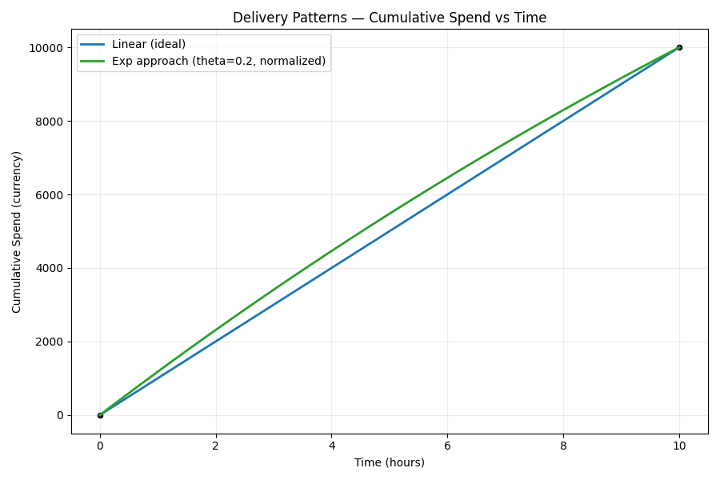
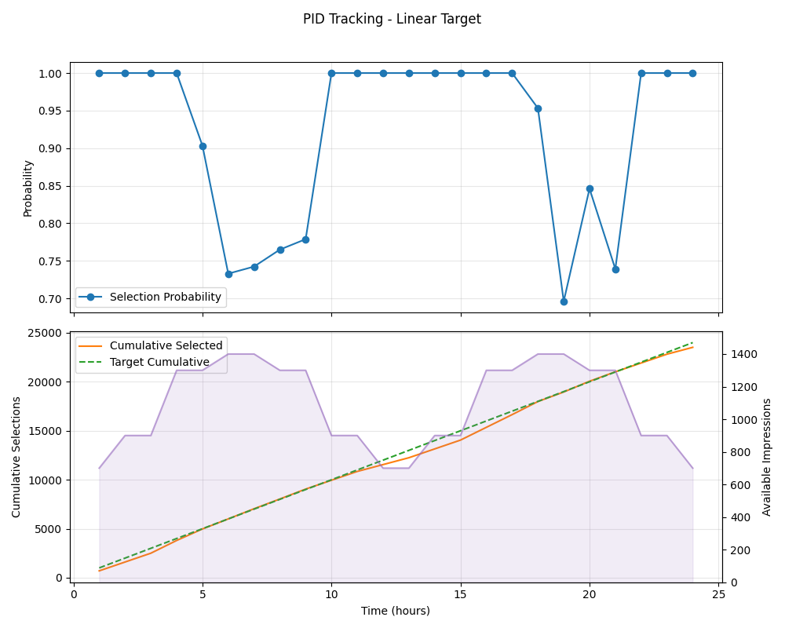
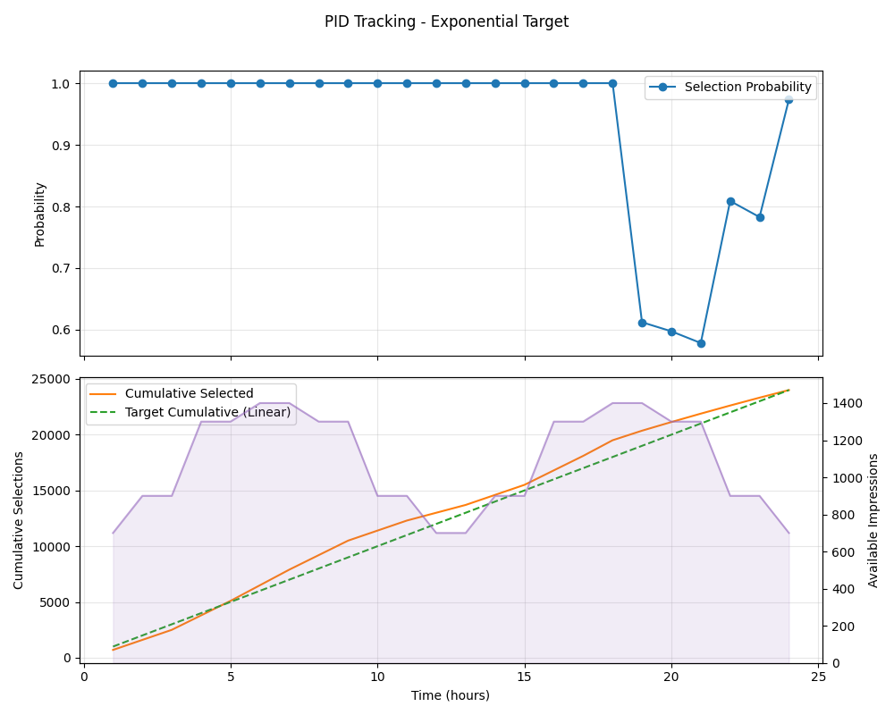
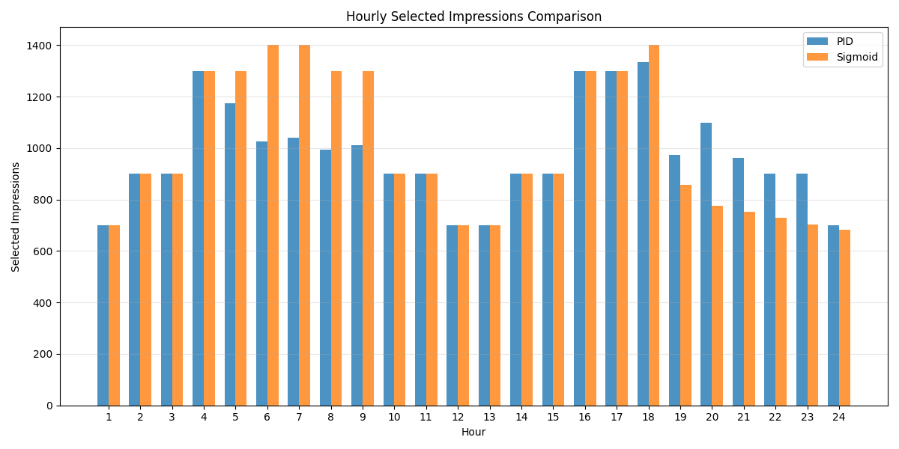

# PID Pacing Algorithm Recommendation

## Overview

This project implements and evaluates a two-tier pacing algorithm for ad campaign delivery optimization. The algorithm combines **PID (Proportional-Integral-Derivative) control** for primary allocation and **Exponential (EXP) distribution** as an upper bound for redistribution, ensuring efficient budget utilization while respecting campaign delivery constraints.

## Algorithm Architecture

### Two-Phase Approach

#### Phase 1: Offline Calculation
Before campaign execution, we calculate:
- **Ideal delivery curve**: Linear cumulative spend across the campaign duration
- **Real delivery curve**: Adjusted based on actual impression availability
- **Delivery probability**: Ratio of desired to available impressions at each time step

Two delivery strategies are evaluated:
1. **PID Control**: Adaptive algorithm that adjusts based on traffic patterns
2. **EXP (Upper Bound)**: Front-loaded exponential distribution providing maximum flexibility

#### Phase 2: Online Redistribution
During campaign execution:
1. **Primary allocation**: Use PID algorithm for all available campaigns
   - Dynamically adjusts delivery rate based on error between ideal and actual spend
2. **Secondary allocation**: If remaining budget and impressions exist
   - Reconsider all campaigns using EXP upper bound probabilities
   - Maximize utilization of available traffic

---

## Delivery Models

### Linear (Ideal) Delivery
The baseline for comparison:
$$y = \frac{t}{T}$$

Where:
- $t$ = current time
- $T$ = total runtime
- $y$ = fraction of budget delivered

### Exponential (EXP) Delivery - Upper Bound
Provides a front-loaded distribution with maximum early delivery:

$$y(x) = 1 - (1 - x) \cdot e^{-\theta \cdot x}$$

Where:
- $x = \frac{t}{T}$ = normalized time (0 to 1)
- $\theta$ = shape parameter controlling curvature
- As $x \to 1$, $y \to 1$ (ensures full delivery)

**Key Property**: The EXP formula delivers more budget early in the campaign, making it an upper bound. This front-loading is visible in the comparison plot below.

---

## PID Control Algorithm

The PID controller adjusts delivery probability in real-time based on the difference between ideal and actual cumulative spend:

```python
error = target_spend - current_spend

integral += error * dt
derivative = (error - prev_error) / dt

output = Kp * error + Ki * integral + Kd * derivative
```

**Parameters**:
- **Kp** (Proportional gain): Immediate response to spend deviation
- **Ki** (Integral gain): Corrects cumulative tracking errors
- **Kd** (Derivative gain): Dampens oscillations and prevents overshoot

**Delivery Probability**:
$$p(t) = \frac{\text{desired impressions}}{\text{available impressions}}$$

Clamped to $[0, 1]$ to ensure valid probabilities.

---

## Results & Visualizations

### 1. Ideal vs Exponential Delivery Curves



This plot shows:
- **Linear (blue)**: Ideal uniform delivery across campaign duration
- **Exponential (orange)**: Front-loaded curve that delivers more early
- The EXP curve provides an upper bound, enabling more aggressive early delivery while still reaching 100% by end of campaign

The exponential curve's steeper initial slope demonstrates its suitability as an upper bound for secondary allocation.

### 2. PID Simulation with Linear Traffic Pattern



Demonstrates PID control following the ideal linear delivery pattern. The algorithm:
- Tracks the desired cumulative spend (linear target)
- Adjusts hourly selection probability based on real-time error
- Recovers from traffic fluctuations through integral correction

### 3. Exponential Simulation with Traffic Pattern



Shows the EXP algorithm's behavior under the same traffic conditions:
- Delivers more budget in early hours
- Front-loaded nature provides buffer for unexpected traffic drops
- Useful for high-volatility traffic scenarios

### 4. Hourly Impression Comparison



Direct comparison of:
- Available impressions (actual traffic pattern)
- Selected impressions via PID control
- Selected impressions via EXP upper bound
- Highlights how each algorithm responds to hourly traffic variations

---

## Recommendation

**Optimal Strategy**:
1. **Primary allocation (PID)**: Use for all campaigns as the default strategy
   - Provides smooth, adaptive delivery tracking
   - Minimizes overspend/underspend through continuous feedback
   
2. **Secondary allocation (EXP)**: Apply to remaining budget/impressions
   - Activates when campaigns have available capacity
   - Front-loaded delivery maximizes utilization
   - Serves as flexible buffer for inventory redistribution

**Advantages**:
- ✅ Adaptive to traffic patterns (PID primary control)
- ✅ Maximizes budget utilization (EXP upper bound secondary)
- ✅ Prevents waste while respecting campaign constraints
- ✅ Handles both smooth and volatile traffic scenarios

---

## Files

- `pid_simulation.py` - Core simulation and PID algorithm implementation
- `plot_compare.py` - Ideal vs exponential delivery curve visualization
- `main.py` - Ideal delivery digraph plotting
- `pid_simulation_pid.csv` - Raw PID simulation results
- `pid_simulation_exp.csv` - Raw EXP simulation results
- `requirements.txt` - Python dependencies (numpy, matplotlib)

---

## Usage

```bash
# Install dependencies
pip install -r requirements.txt

# Run simulations
python pid_simulation.py

# Generate comparison plots
python plot_compare.py
```

---

## Parameters

Default configuration:
- **Budget**: 10,000 units
- **Runtime**: 10 hours
- **PID Gains**: Kp=0.8, Ki=0.05, Kd=0.01
- **EXP theta**: 0.2 (controls exponential curvature)

These can be adjusted in the respective Python files to suit different campaign profiles.
