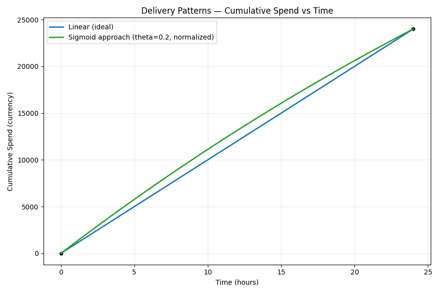
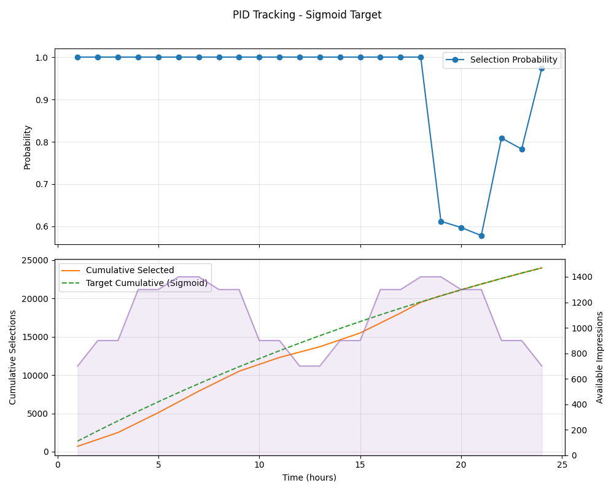

# PID Pacing Algorithm Recommendation

## Overview

This project implements and evaluates a two-tier pacing algorithm for ad campaign delivery optimization. The algorithm combines **PID (Proportional-Integral-Derivative) control** for primary allocation and **Sigmoid distribution** as an upper bound for redistribution, ensuring efficient budget utilization while respecting campaign delivery constraints.

## Algorithm Architecture

### Two-Phase Approach

#### Phase 1: Offline Calculation
Before campaign execution, we calculate two delivery probabilities:
1. **PID Probability**: Based on linear delivery curve, adjusted with actual traffic patterns
2. **Sigmoid Probability**: Based on configurable front-loaded delivery curve

#### Phase 2: Online Redistribution
During campaign execution:
1. **Primary allocation**: Use PID algorithm for all available campaigns
   - Dynamically adjusts delivery rate based on error between ideal and actual spend
2. **Secondary allocation**: If remaining budget and impressions exist
   - Reconsider all campaigns using Sigmoid upper bound probabilities
   - Maximize utilization of available traffic

---

## Delivery Models

### Linear (Ideal) Delivery
The baseline for comparison:
$$y = \frac{t}{T}$$

Where:
- $t$ = current time
- $T$ = total runtime
- $y$ = fraction of budget delivered

### Sigmoid Delivery - Upper Bound
Provides a front-loaded distribution with maximum early delivery:

$$y(x) = 1 - (1 - x) \cdot e^{-\theta \cdot x}$$

Where:
- $x = \frac{t}{T}$ = normalized time (0 to 1)
- $\theta$ = shape parameter controlling curvature
- As $x \to 1$, $y \to 1$ (ensures full delivery)

**Key Property**: The Sigmoid formula delivers more budget early in the campaign, making it an upper bound. This front-loading is visible in the comparison plot below.

---

## PID Control Algorithm

The PID controller adjusts delivery probability in real-time based on the difference between ideal and actual cumulative spend:

```python
error = target_spend - current_spend

integral += error * dt
derivative = (error - prev_error) / dt

output = Kp * error + Ki * integral + Kd * derivative
```

**Parameters**:
- **Kp** (Proportional gain): Immediate response to spend deviation
- **Ki** (Integral gain): Corrects cumulative tracking errors
- **Kd** (Derivative gain): Dampens oscillations and prevents overshoot

**Delivery Probability**:
$$p(t) = \frac{\text{desired impressions}}{\text{available impressions}}$$

Clamped to $[0, 1]$ to ensure valid probabilities.

---

## Results & Visualizations

### 1. Ideal vs Sigmoid Delivery Curves



This plot shows:
- **Linear (blue)**: Ideal uniform delivery across campaign duration
- **Sigmoid (green)**: Front-loaded curve that delivers more early
- The Sigmoid curve provides an upper bound, enabling more aggressive early delivery while still reaching 100% by end of campaign

The sigmoid curve's steeper initial slope demonstrates its suitability as an upper bound for secondary allocation.

### 2. PID Simulation with Linear Traffic Pattern


Demonstrates PID control following the ideal linear delivery pattern. The algorithm:
- Tracks the desired cumulative spend (linear target)
- Adjusts hourly selection probability based on real-time error

### 3. Sigmoid Simulation with Traffic Pattern



Shows the Sigmoid algorithm's behavior under the same traffic conditions:
- Delivers more budget in early hours

### 4. Hourly Impression Comparison


Direct comparison of:
- Available impressions (actual traffic pattern)
- Selected impressions via PID control
- Selected impressions via Sigmoid upper bound

---

## Files

- `pid_simulation.py` - Core simulation and PID algorithm implementation
- `plot_compare.py` - Ideal vs sigmoid delivery curve visualization
- `main.py` - Ideal delivery digraph plotting
- `pid_simulation_pid.csv` - Raw PID simulation results
- `pid_simulation_sigmoid.csv` - Raw Sigmoid simulation results
- `requirements.txt` - Python dependencies (numpy, matplotlib)

---

## Usage

```bash
# Install dependencies
pip install -r requirements.txt

# Run simulations for PID and front load
python pid_simulation.py

# Generate comparison plots for front load and linear load
python plot_compare.py
```

---

## Parameters

Default configuration:
- **Budget**: 24,000 units
- **Runtime**: 24 hours
- **PID Gains**: Kp=1.0472, Ki=0.00, Kd=0.2742
- **Sigmoid theta**: 0.2 (controls sigmoid curvature)

These can be adjusted in the respective Python files to suit different campaign profiles.
